# xCloudLisbot — AI 會議智慧記錄系統

> **即時字幕 · 說話者分離 · AI 雙輪摘要 · 行事曆整合 · 術語強化 · 多語言 · 團隊協作**

---

## 📖 About

xCloudLisbot 是基於 Azure 雲端原生技術打造的企業級 AI 會議記錄 SaaS 平台。

透過 **Azure Web PubSub** 實現低延遲即時語音轉錄、**Azure Speech ConversationTranscriber** 自動說話者分離、**Azure OpenAI GPT-4** 雙輪智慧摘要，並整合 Google Calendar / Microsoft Exchange 行事曆、專業術語辭典注入、音檔批次轉錄及基本團隊協作功能。

後端以 **FastAPI + Docker** 部署至 **Azure Container Apps**，資料庫採用 **PostgreSQL + SQLAlchemy**，前端為 **React 18 + TypeScript** 靜態應用部署至 **Azure Static Web Apps**，所有機密由 **Azure Key Vault** 統一管理。

---

## ✨ 功能總覽

| 功能模組 | 說明 | 技術實作 |
|---------|------|---------|
| 🎙️ **多模式即時字幕** | 7 種會議模式（會議/訪談/腦力激盪/課堂/站會/評審/客戶），含說話者自動分離 | Azure Speech ConversationTranscriber + Azure Web PubSub |
| 📅 **行事曆一鍵啟動** | 整合 Google Calendar & Microsoft Exchange，從行程直接啟動錄音 | Google Calendar API / Microsoft Graph API + OAuth 2.0 |
| 🗣️ **台語/客語支援** | 支援 nan-TW、hak-TW 語音輸入，自動以繁中輸出 | Azure Speech 多語言 + PhraseList fallback |
| 📁 **音檔上傳批次轉錄** | 支援 MP3/WAV/MP4/M4A/OGG/FLAC，最大 200MB，非同步批次轉錄 | Azure Speech Batch Transcription API + Blob Storage |
| 📋 **多種摘要範本** | 7 種內建範本 + 無限自訂，支援 GPT System Prompt 完整覆寫 | Azure OpenAI GPT-4 雙輪生成 |
| 📚 **術語辭典強化** | 建立專業術語對照表，透過 PhraseListGrammar 注入 Speech 引擎 | Azure Speech PhraseListGrammar API |
| 🌐 **多語言處理** | 繁中/英/日/簡中/台語/客語/自動偵測 | Azure Speech 7 語言 + GPT-4 多語言摘要 |
| 👥 **基本團隊協作** | 會議分享（檢視/編輯權限）、邀請成員、撤銷管理 | PostgreSQL shares 資料表 + JWT 驗證 |
| 🔐 **多平台 OAuth** | Microsoft / Google / GitHub / Apple 四平台，JWT 24 小時有效 | MSAL.js + OAuth 2.0 PKCE + Azure Key Vault |
| 📧 **Email 邀請通知** | 分享會議時寄送邀請 Email | Azure Communication Services Email |

---

## 🏗️ 技術棧

| 層次 | 技術 | 說明 |
|------|------|------|
| **前端** | React 18 + TypeScript + Tailwind CSS | CRA 5，react-router-dom v7，lucide-react |
| **後端** | FastAPI 0.115 + Python 3.11 | Docker 容器，gunicorn + uvicorn workers |
| **部署（後端）** | Azure Container Apps | Docker image 推送至 ACR，藍綠部署 |
| **部署（前端）** | Azure Static Web Apps | Standard 方案，自動 CDN |
| **即時通訊** | Azure Web PubSub (WebSocket Hub) | Standard S1，Hub: speech_hub |
| **AI 語音** | Azure AI Speech | ConversationTranscriber + Batch Transcription API |
| **AI 摘要** | Azure OpenAI GPT-4.1 | 雙輪生成：Markdown 摘要 + JSON 結構化 |
| **資料庫** | PostgreSQL + SQLAlchemy 2.0 | psycopg2，schema 由 Base.metadata.create_all() 初始化 |
| **檔案儲存** | Azure Blob Storage（GRS） | audio-recordings container，SAS Token 授權 |
| **密鑰管理** | Azure Key Vault | Managed Identity 存取 |
| **Rate Limiting** | slowapi | 各端點獨立限速 |
| **Email** | Azure Communication Services Email | 分享邀請通知 |
| **基礎建設** | Terraform ≥ 1.5 | azurerm ~4.0 |
| **CI/CD** | GitHub Actions | backend → ACR + Container Apps；frontend → Static Web Apps |

---

## 🗺️ 系統架構圖

```mermaid
graph TB
    %% ── 使用者端 ──────────────────────────────────────────
    subgraph Browser["🖥️  使用者瀏覽器（React 18 + TypeScript + Tailwind CSS）"]
        direction TB
        FE_AUTH["OAuthButtons\n四平台登入"]
        FE_CAL["CalendarPanel\nGoogle / Outlook 行程"]
        FE_REC["RecordingPanel\n即時錄音 + WebSocket"]
        FE_UPL["AudioUploadPanel\n音檔上傳 + 轉錄輪詢"]
        FE_TRX["TranscriptView\n即時逐字稿（說話者色碼）"]
        FE_SUM["SummaryPanel\nMarkdown 摘要 + Action Items"]
        FE_MOD["Modals\n術語辭典 / 摘要範本 / 協作分享"]
        FE_DASH["DashboardPage\n會議列表 + 搜尋 + 批次刪除"]
        FE_MSAL["MSAL.js\nMicrosoft Token Cache"]
    end

    %% ── Azure Container Apps 後端 ────────────────────────
    subgraph ContainerApps["🐳  Azure Container Apps（FastAPI 0.115 · Python 3.11 · Docker）"]
        direction TB
        subgraph Auth["🔐 認證層"]
            F_AUTH["OAuth Callback\nMS / Google / GitHub / Apple"]
            F_JWT["JWT 簽發 & 驗證\nHS256 · 24h TTL"]
        end
        subgraph Core["🧠 核心業務"]
            F_WS_TOK["GET /api/ws/token\n發放 PubSub Client URL"]
            F_MEET["Meetings CRUD\n+ batch-delete"]
            F_SUM["POST /api/summarize\nGPT-4 雙輪摘要"]
            F_UPLOAD["POST /api/meetings/{id}/upload\nBlob + Batch Transcription"]
            F_STATUS["GET .../transcription-status\n輪詢批次轉錄結果"]
            F_SPEECH["GET /api/speech-token\nAzure Speech 短效 Token"]
            F_TERM["Terminology CRUD\n術語辭典"]
            F_TMPL["Templates CRUD\n摘要範本"]
            F_SHARE["Share CRUD\n協作分享 + Email 邀請"]
            F_CAL["Calendar API\n連線 + OAuth + Events"]
        end
        RL["slowapi Rate Limiter\n各端點獨立限速"]
    end

    %% ── Azure PubSub ─────────────────────────────────────
    subgraph PubSub["📡  Azure Web PubSub（Standard S1 · Hub: speech_hub）"]
        PS_HUB["WebSocket Hub\nce-userid 識別"]
    end

    %% ── AI 服務 ──────────────────────────────────────────
    subgraph AI["🤖  Azure AI Services"]
        subgraph Speech["Azure AI Speech（Standard S0）"]
            S_RT["ConversationTranscriber\n即時說話者分離\nPhraseListGrammar 術語注入"]
            S_BATCH["Batch Transcription API\n非同步音檔轉錄"]
        end
        subgraph OpenAI["Azure OpenAI（GPT-4.1）"]
            O_ROUND1["第一輪\n模式/範本 System Prompt → Markdown 摘要"]
            O_ROUND2["第二輪\nMarkdown → JSON\nactionItems / keyDecisions"]
        end
    end

    %% ── 資料儲存 ─────────────────────────────────────────
    subgraph StorageLayer["💾  Azure 資料儲存層"]
        subgraph PG["PostgreSQL（SQLAlchemy 2.0）"]
            T_USR[("users")]
            T_MTG[("meetings")]
            T_TRX[("transcripts")]
            T_SUM[("summaries")]
            T_TRM[("terminology")]
            T_TPL[("templates")]
            T_SHR[("shares")]
            T_CAL[("calendar_tokens")]
        end
        BLOB["Azure Blob Storage GRS\naudio-recordings\nSAS Token 授權"]
    end

    %% ── 安全 & 身份 ──────────────────────────────────────
    subgraph Security["🔒  安全 & 身份層"]
        KV["Azure Key Vault\nManaged Identity 存取"]
        ACR["Azure Container Registry\nDocker Images"]
        subgraph OAuthP["外部 OAuth"]
            O_MS["Microsoft Entra ID\n+ Graph API Calendar"]
            O_GG["Google OAuth 2.0\n+ Calendar API"]
            O_GH["GitHub OAuth App"]
            O_AP["Apple Sign In"]
        end
    end

    ACS["📧 Azure Communication\nServices Email"]

    %% ── 連線關係 ─────────────────────────────────────────
    FE_MSAL -->|acquireTokenSilent| O_MS
    FE_AUTH -->|OAuth Popup| O_MS & O_GG & O_GH & O_AP
    FE_CAL -->|GET /api/calendar/*| F_CAL
    FE_REC -->|1. GET /api/speech-token| F_SPEECH
    FE_REC -->|2. GET /api/ws/token| F_WS_TOK
    F_WS_TOK -->|Client Access URL| PS_HUB
    FE_REC -->|3. WebSocket| PS_HUB
    PS_HUB -->|Event → ConversationTranscriber| S_RT
    S_RT -->|逐字稿結果 push| PS_HUB
    PS_HUB -->|type:transcript| FE_TRX
    FE_UPL -->|POST .../upload| F_UPLOAD
    F_UPLOAD -->|上傳音檔| BLOB
    F_UPLOAD -->|SAS URL → Batch Job| S_BATCH
    FE_UPL -->|輪詢 transcription-status| F_STATUS
    FE_SUM -->|POST /api/summarize| F_SUM
    F_SUM --> O_ROUND1 --> O_ROUND2
    F_SHARE -->|邀請 Email| ACS
    ContainerApps -->|Managed Identity| KV
    KV -.->|Secrets Inject| ContainerApps
    ACR -.->|pull image| ContainerApps
    F_AUTH & F_MEET & F_SUM & F_TERM & F_TMPL & F_SHARE & F_CAL -->|SQLAlchemy| PG
```



---

## 🗄️ 資料庫 Schema

PostgreSQL，共 8 張資料表，由 SQLAlchemy `Base.metadata.create_all()` 自動建立：

| 資料表 | 主鍵 | 索引 | 說明 |
|--------|------|------|------|
| `users` | `id` (String) | — | OAuth 使用者，provider 欄位記錄登入平台 |
| `meetings` | `id` (String) | `user_id`, `share_token` | 會議主記錄，含 status / mode / language |
| `transcripts` | `id` (String) | `meeting_id` | 逐字稿片段，含 speaker / offset / confidence |
| `summaries` | `id` (String) | `meeting_id` | AI 摘要，JSON 欄位存 action_items / key_decisions |
| `terminology` | `id` (String) | `user_id` | 術語辭典，terms 為 JSON 陣列 |
| `templates` | `id` (String) | `user_id` | 摘要範本，system_prompt_override 自訂 GPT 指令 |
| `shares` | `id` (String) | `meeting_id`, `member_email` | 會議分享關係，permission: view/edit |
| `calendar_tokens` | `id` (String) | — | OAuth 行事曆 Token 儲存 |

---

## 📁 目錄結構

```
xCloudLisbot/
├── backend/                    # FastAPI 後端
│   ├── blueprints/             # API Router 模組
│   │   ├── auth_microsoft.py   # Microsoft OAuth
│   │   ├── auth_google.py      # Google OAuth
│   │   ├── auth_github.py      # GitHub OAuth
│   │   ├── auth_apple.py       # Apple Sign In
│   │   ├── auth_dev.py         # 開發環境快速登入
│   │   ├── meetings.py         # 會議 CRUD + batch-delete
│   │   ├── speech.py           # Azure Speech Token 端點
│   │   ├── summarize.py        # GPT-4 雙輪摘要
│   │   ├── terminology.py      # 術語辭典 CRUD
│   │   ├── templates.py        # 摘要範本 CRUD
│   │   ├── upload.py           # 音檔上傳 + Batch Transcription
│   │   ├── share.py            # 協作分享 + Email 邀請
│   │   ├── calendar_bp.py      # 行事曆整合（Google / Outlook）
│   │   └── health.py           # 健康檢查
│   ├── shared/
│   │   ├── config.py           # 環境變數 + Lazy-init 服務客戶端
│   │   ├── database.py         # SQLAlchemy models + session
│   │   ├── auth.py             # JWT 驗證
│   │   ├── access.py           # 存取控制
│   │   ├── email.py            # Azure ACS Email
│   │   └── responses.py        # 標準回應格式
│   ├── main.py                 # FastAPI app 入口（uvicorn/gunicorn）
│   ├── function_app.py         # Azure Functions v4 入口（備用）
│   ├── Dockerfile              # 容器化設定
│   ├── requirements.txt
│   └── host.json
├── frontend/                   # React 18 前端
│   ├── src/
│   │   ├── pages/              # 頁面元件
│   │   │   ├── DashboardPage.tsx       # 會議列表（滑動刪除/批次選取）
│   │   │   ├── RecordingPage.tsx       # 即時錄音
│   │   │   ├── UploadPage.tsx          # 音檔上傳
│   │   │   ├── MeetingDetailPage.tsx   # 會議詳情
│   │   │   ├── SettingsPage.tsx        # 個人設定
│   │   │   └── SharedMeetingPage.tsx   # 分享連結頁
│   │   ├── components/         # UI 元件
│   │   │   ├── RecordingPanel.tsx
│   │   │   ├── AudioUploadPanel.tsx
│   │   │   ├── TranscriptView.tsx
│   │   │   ├── SummaryPanel.tsx
│   │   │   ├── CalendarPanel.tsx
│   │   │   ├── OAuthButtons.tsx
│   │   │   ├── ShareMeetingModal.tsx
│   │   │   ├── SummaryTemplateModal.tsx
│   │   │   └── TermDictionaryModal.tsx
│   │   ├── hooks/              # Custom hooks
│   │   ├── services/           # API 呼叫封裝
│   │   ├── contexts/           # React Context
│   │   └── types/              # TypeScript 型別
│   ├── package.json
│   └── tailwind.config.js
├── infrastructure/             # Terraform IaC
│   ├── main.tf
│   ├── variables.tf
│   ├── outputs.tf
│   └── terraform.tfvars.example
├── docs/
│   ├── 操作手冊.md
│   ├── azure-部署手冊.md
│   └── oauth-setup.md
├── .env.example                # 環境變數範例
└── .github/workflows/
    ├── backend-deploy.yml      # 後端 CI/CD
    └── frontend-deploy.yml     # 前端 CI/CD
```

---

## 🚀 快速開始（本地開發）

### 前置需求

- Python 3.11+
- Node.js 20+
- PostgreSQL 15+（或 Docker）
- Azure 訂閱（Speech / OpenAI / Web PubSub / Blob Storage）

### 後端

```bash
cd backend

# 複製環境變數
cp ../local.settings.json.example local.settings.json
# 填入 AZURE_OPENAI_ENDPOINT、SPEECH_KEY、PG_HOST 等必要變數

pip install -r requirements.txt

# 啟動開發伺服器
uvicorn main:app --reload --port 8000
```

### 前端

```bash
cd frontend

# 複製環境變數
cp .env.example .env
# 填入 REACT_APP_AZURE_CLIENT_ID、REACT_APP_BACKEND_URL 等

npm ci
npm start   # 預設 http://localhost:3000
```

> **提示**：前端 `package.json` 中 `"proxy": "http://localhost:7071"` 設定僅供 Azure Functions 本地開發使用，  
> 若使用 `uvicorn` 直接啟動後端，請在 `.env` 中設定 `REACT_APP_BACKEND_URL=http://localhost:8000`。

### Docker（後端）

```bash
cd backend
docker build -t lisbot-api .
docker run -p 8000:8000 --env-file .env lisbot-api
```

---

## ⚙️ 環境變數

完整範例請參考根目錄 [`.env.example`](.env.example)。

### 前端（`frontend/.env`）

| 變數 | 說明 |
|------|------|
| `REACT_APP_AZURE_CLIENT_ID` | Microsoft Entra App 的 Client ID |
| `REACT_APP_AZURE_TENANT_ID` | Tenant ID，多租戶填 `common` |
| `REACT_APP_GOOGLE_CLIENT_ID` | Google OAuth 2.0 Client ID |
| `REACT_APP_GITHUB_CLIENT_ID` | GitHub OAuth App Client ID |
| `REACT_APP_BACKEND_URL` | 後端 API 基底 URL |

### 後端

| 變數 | 說明 |
|------|------|
| `AZURE_OPENAI_ENDPOINT` | Azure OpenAI 端點 URL |
| `AZURE_OPENAI_KEY` | Azure OpenAI API 金鑰 |
| `AZURE_OPENAI_DEPLOYMENT` | 模型部署名稱（預設 `gpt-4`） |
| `SPEECH_KEY` | Azure AI Speech 金鑰 |
| `SPEECH_REGION` | Speech 區域（預設 `eastasia`） |
| `PG_HOST` | PostgreSQL 主機 |
| `PG_PORT` | PostgreSQL 連接埠（預設 `5432`） |
| `PG_DATABASE` | 資料庫名稱（預設 `lisbot`） |
| `PG_USER` | 資料庫使用者 |
| `PG_PASSWORD` | 資料庫密碼 |
| `PG_SSL` | SSL 模式（預設 `require`） |
| `AZURE_STORAGE_CONNECTION_STRING` | Blob Storage 連線字串 |
| `STORAGE_CONTAINER` | 音檔容器名稱（預設 `audio-recordings`） |
| `WEB_PUBSUB_ENDPOINT` | Azure Web PubSub 端點 |
| `WEB_PUBSUB_KEY` | Azure Web PubSub 金鑰 |
| `WEB_PUBSUB_HUB` | Hub 名稱（預設 `speech_hub`） |
| `JWT_SECRET` | JWT 簽章密鑰（生產環境需 ≥ 32 字元） |
| `MICROSOFT_CLIENT_ID` | Microsoft OAuth Client ID |
| `MICROSOFT_CLIENT_SECRET` | Microsoft OAuth Client Secret |
| `GOOGLE_CLIENT_ID` | Google OAuth Client ID |
| `GOOGLE_CLIENT_SECRET` | Google OAuth Client Secret |
| `GITHUB_CLIENT_ID` | GitHub OAuth Client ID |
| `GITHUB_CLIENT_SECRET` | GitHub OAuth Client Secret |
| `APPLE_TEAM_ID` | Apple Developer Team ID |
| `APPLE_KEY_ID` | Apple Sign In Key ID |
| `APPLE_CLIENT_ID` | Apple Sign In Client ID（Services ID） |
| `APPLE_PRIVATE_KEY` | Apple Sign In 私鑰（PEM 格式） |
| `FRONTEND_URL` | 前端 URL（CORS 白名單） |
| `ALLOWED_ORIGINS` | 允許的 CORS Origins（逗號分隔） |
| `ENVIRONMENT` | 環境標識（`development` / `production`） |
| `ACS_CONNECTION_STRING` | Azure Communication Services 連線字串 |
| `ACS_SENDER_EMAIL` | 寄件者 Email 地址 |

---

## 🚢 部署

### GitHub Actions CI/CD

| Workflow | 觸發條件 | 目標 |
|----------|---------|------|
| `backend-deploy.yml` | `push` → `main`（`backend/**`） | Build Docker image → 推送至 ACR → 更新 Azure Container Apps |
| `frontend-deploy.yml` | `push` / PR → `main`（`frontend/**`） | `npm run build` → 部署至 Azure Static Web Apps |

### GitHub Actions Secrets 設定

| Secret | 說明 |
|--------|------|
| `AZURE_CREDENTIALS` | `az ad sp create-for-rbac` 輸出的 JSON |
| `AZURE_STATIC_WEB_APPS_API_TOKEN` | Static Web Apps 部署 Token |
| `REACT_APP_AZURE_CLIENT_ID` | 前端 Microsoft Client ID |
| `REACT_APP_GOOGLE_CLIENT_ID` | 前端 Google Client ID |
| `REACT_APP_GITHUB_CLIENT_ID` | 前端 GitHub Client ID |
| `REACT_APP_BACKEND_URL` | 後端 API URL（Container Apps URL） |

### Terraform 基礎建設

```bash
cd infrastructure
cp terraform.tfvars.example terraform.tfvars
# 填入 subscription_id、各 OAuth 參數等

terraform init
terraform plan
terraform apply
```

詳細部署步驟請參考 [`docs/azure-部署手冊.md`](docs/azure-部署手冊.md)。

---

## 📚 文件

| 文件 | 說明 |
|------|------|
| [操作手冊](docs/操作手冊.md) | 使用者完整操作指引 |
| [Azure 部署手冊](docs/azure-部署手冊.md) | 雲端部署步驟 |
| [OAuth 設定說明](docs/oauth-setup.md) | 四平台 OAuth 設定教學 |

---

## 🔒 安全注意事項

- 生產環境 `JWT_SECRET` 必須 ≥ 32 字元，否則後端啟動時會直接拋出 `RuntimeError`
- 所有 API 金鑰透過 **Azure Key Vault** + **Managed Identity** 注入，不直接寫入程式碼
- Azure Blob Storage 使用 **SAS Token**（12 小時有效期）授權，不對外公開
- 音檔 Container 存取類型為 `private`
- OAuth 登入後端不儲存第三方 access token（行事曆 OAuth token 除外，加密存入 `calendar_tokens` 資料表）

---

*如需技術支援，請至 [GitHub Issues](../../issues) 回報問題。*
