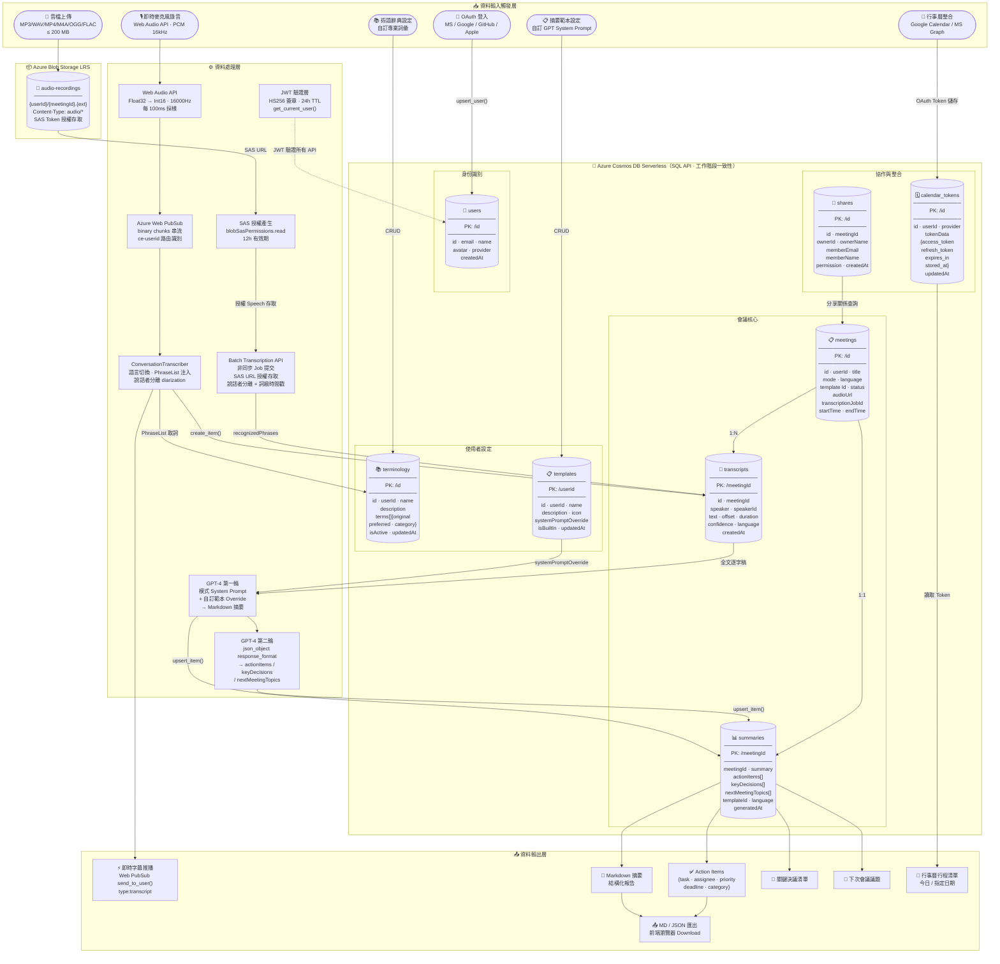

# xCloudLisbot — AI 會議智慧記錄系統 v2.0

> **即時字幕 · 說話者分離 · AI 雙輪摘要 · 行事曆整合 · 術語強化 · 多語言 · 團隊協作**

xCloudLisbot 是基於 Azure 雲端原生技術打造的企業級 AI 會議記錄 SaaS 平台。透過 Azure Web PubSub 實現低延遲即時語音轉錄、Azure Speech ConversationTranscriber 自動說話者分離、Azure OpenAI GPT-4 雙輪智慧摘要，並整合 Google Calendar / Microsoft Exchange 行事曆、專業術語辭典注入、音檔批次轉錄及基本團隊協作功能。

---

## ✨ 功能總覽

| 功能模組 | 說明 | 技術實作 |
|---------|------|---------|
| 🎙️ **多模式即時字幕** | 7 種會議模式（會議/訪談/腦力激盪/課堂/站會/評審/客戶），含說話者自動分離 | Azure Speech ConversationTranscriber + Azure Web PubSub |
| 📅 **行事曆一鍵啟動** | 整合 Google Calendar & Microsoft Exchange，從行事曆直接啟動錄音 | Google Calendar API / Microsoft Graph API + OAuth 2.0 |
| 🗣️ **台語/客語支援** | 支援 nan-TW、hak-TW 語音輸入，自動以繁中輸出 | Azure Speech 多語言 + PhraseList fallback |
| 📁 **音檔上傳批次轉錄** | 支援 MP3/WAV/MP4/M4A/OGG/FLAC，最大 200MB，非同步批次轉錄 | Azure Speech Batch Transcription API + Blob Storage SAS |
| 📋 **多種摘要範本** | 7 種內建範本 + 無限自訂，支援 GPT System Prompt 完整覆寫 | Azure OpenAI GPT-4 Turbo 雙輪生成 |
| 📚 **術語辭典強化** | 建立專業術語對照表，透過 PhraseListGrammar 注入 Speech 引擎 | Azure Speech PhraseListGrammar API |
| 🌐 **多語言處理** | 繁中/英/日/簡中/台語/客語/自動偵測，輸出語言可設定 | Azure Speech 7 語言 + GPT-4 多語言摘要 |
| 👥 **基本團隊協作** | 會議分享（檢視/編輯權限）、邀請成員、撤銷管理 | Cosmos DB shares container + JWT 驗證 |
| 🔐 **多平台 OAuth** | Microsoft / Google / GitHub / Apple 四平台，JWT 24 小時有效 | MSAL.js + OAuth 2.0 PKCE + Azure Key Vault |

---

## 🏗️ 技術棧

| 層次 | 技術 | 版本 |
|------|------|------|
| **前端** | React + TypeScript + Tailwind CSS + MSAL.js | React 18 / TS 5 / Vite 5 |
| **後端** | Azure Functions (Python) | v4 / Python 3.11 |
| **即時通訊** | Azure Web PubSub (WebSocket Hub) | Standard S1 |
| **AI 語音** | Azure AI Speech — ConversationTranscriber + Batch API | SDK 1.35 |
| **AI 摘要** | Azure OpenAI GPT-4 Turbo（雙輪：Markdown + JSON 結構化） | API 2024-02-01 |
| **資料庫** | Azure Cosmos DB Serverless（NoSQL SQL API，8 containers） | SDK 4.7 |
| **檔案儲存** | Azure Blob Storage LRS + SAS Token 授權 | SDK 12.19 |
| **密鑰管理** | Azure Key Vault | Standard |
| **基礎建設** | Terraform IaC | ≥ 1.5 |
| **CI/CD** | GitHub Actions | — |

---

## 🗺️ 系統架構圖

> 呈現各 Azure 服務之間的依賴關係、資料流向與安全邊界

```mermaid
graph TB
    %% ── 使用者端 ──────────────────────────────────────────
    subgraph Browser["🖥️  使用者瀏覽器（React 18 + TypeScript + Tailwind CSS）"]
        direction TB
        FE_AUTH["OAuthButtons\n四平台登入"]
        FE_CAL["CalendarPanel\nGoogle / Outlook 行程"]
        FE_CFG["MeetingConfigCard\n模式・語言・範本・術語"]
        FE_REC["RecordingPanel\n即時錄音 + WebSocket"]
        FE_UPL["AudioUploadPanel\n音檔上傳 + 批次轉錄輪詢"]
        FE_TRX["TranscriptView\n即時逐字稿（說話者色碼）"]
        FE_SUM["SummaryPanel\nMarkdown 摘要 + Action Items"]
        FE_MOD["Modals\n術語辭典 / 摘要範本 / 協作分享"]
        FE_MSAL["MSAL.js\nMicrosoft Token Cache"]
    end

    %% ── Azure Functions 後端 ─────────────────────────────
    subgraph Functions["⚙️  Azure Functions v4（Python 3.11 · Linux EP2）"]
        direction TB
        subgraph Auth["🔐 認證層（7 端點）"]
            F_AUTH["OAuth Callback\nMS / Google / GitHub / Apple"]
            F_JWT["JWT 簽發 & 驗證\nHS256 · 24h 有效"]
        end
        subgraph Core["🧠 核心業務（26 端點）"]
            F_WS_TOK["GET /api/ws/token\n發放 PubSub Client URL"]
            F_MEET["Meetings CRUD\nPOST · GET /api/meetings"]
            F_SUM["POST /api/summarize\nGPT-4 雙輪摘要"]
            F_UPLOAD["POST /api/meetings/{id}/upload\nBlob + Batch Transcription"]
            F_STATUS["GET .../transcription-status\n輪詢批次轉錄結果"]
            F_TERM["Terminology CRUD\n術語辭典 4 端點"]
            F_TMPL["Templates CRUD\n摘要範本 4 端點"]
            F_SHARE["Share CRUD\n協作分享 3 端點"]
            F_CAL["Calendar API\n連線 + OAuth + Events 5 端點"]
        end
        subgraph WS_HANDLER["📡 WebSocket Event Handler"]
            F_SPEECH["POST /ws/speech\nPubSub Event Handler\n音訊處理 + 術語注入 + 推播"]
        end
    end

    %% ── Azure PubSub ─────────────────────────────────────
    subgraph PubSub["📡  Azure Web PubSub（Standard S1 · Hub: speech_hub）"]
        PS_HUB["WebSocket Hub\nce-userid / ce-connectionid 識別"]
        PS_EVENT["Event Routing\nuser.message → /ws/speech\nsys.connect → JWT 驗證"]
    end

    %% ── AI 服務 ──────────────────────────────────────────
    subgraph AI["🤖  Azure AI Services"]
        subgraph Speech["Azure AI Speech（Standard S0）"]
            S_RT["ConversationTranscriber\n即時說話者分離\nPhraseListGrammar 術語注入"]
            S_BATCH["Batch Transcription API\n非同步音檔轉錄\n說話者分離 + 詞級時間戳"]
        end
        subgraph OpenAI["Azure OpenAI（GPT-4 Turbo）"]
            O_ROUND1["第一輪生成\n模式/範本 System Prompt\n→ Markdown 摘要"]
            O_ROUND2["第二輪結構化\nMarkdown → JSON\nactionItems / keyDecisions"]
        end
    end

    %% ── 資料儲存 ─────────────────────────────────────────
    subgraph Storage["💾  Azure 資料儲存層"]
        subgraph Cosmos["Azure Cosmos DB Serverless（SQL API）"]
            DB_USR[("users\n/id")]
            DB_MTG[("meetings\n/id")]
            DB_TRX[("transcripts\n/meetingId")]
            DB_SUM[("summaries\n/meetingId")]
            DB_TRM[("terminology\n/id")]
            DB_TPL[("templates\n/userId")]
            DB_SHR[("shares\n/id")]
            DB_CAL[("calendar_tokens\n/id")]
        end
        BLOB["Azure Blob Storage LRS\naudio-recordings/{userId}/{meetingId}.ext\nSAS Token 12h 授權"]
    end

    %% ── 安全 & 身份 ──────────────────────────────────────
    subgraph Security["🔒  安全 & 身份層"]
        KV["Azure Key Vault\n所有 API Keys & Secrets\nManaged Identity 存取"]
        subgraph OAuthProviders["外部 OAuth 提供商"]
            O_MS["Microsoft Entra ID\n+ Graph API Calendar"]
            O_GG["Google OAuth 2.0\n+ Calendar API"]
            O_GH["GitHub OAuth App"]
            O_AP["Apple Sign In"]
        end
    end

    %% ── 連線關係 ─────────────────────────────────────────
    FE_MSAL -->|"acquireTokenSilent"| O_MS
    FE_AUTH -->|"OAuth Popup"| O_MS & O_GG & O_GH & O_AP
    FE_CAL -->|"GET /api/calendar/*"| F_CAL
    FE_REC -->|"1. GET /api/ws/token"| F_WS_TOK
    F_WS_TOK -->|"Client Access URL"| PS_HUB
    FE_REC -->|"2. WebSocket（PCM binary）"| PS_HUB
    PS_EVENT -->|"POST /ws/speech"| F_SPEECH
    F_SPEECH -->|"ConversationTranscriber"| S_RT
    S_RT -->|"逐字稿結果"| F_SPEECH
    F_SPEECH -->|"send_to_user()"| PS_HUB
    PS_HUB -->|"type:transcript"| FE_TRX
    F_SPEECH -->|"create_item()"| DB_TRX

    FE_UPL -->|"POST /api/meetings/{id}/upload"| F_UPLOAD
    F_UPLOAD -->|"上傳音檔"| BLOB
    F_UPLOAD -->|"SAS URL → Batch Job"| S_BATCH
    FE_UPL -->|"GET .../transcription-status（輪詢）"| F_STATUS
    S_BATCH -->|"recognizedPhrases"| F_STATUS

    FE_SUM -->|"POST /api/summarize"| F_SUM
    F_SUM -->|"第一輪"| O_ROUND1
    O_ROUND1 -->|"Markdown"| O_ROUND2
    O_ROUND2 -->|"JSON"| F_SUM
    F_SUM -->|"upsert_item()"| DB_SUM

    F_AUTH -->|"upsert_user()"| DB_USR
    F_MEET -->|"CRUD"| DB_MTG
    F_TERM -->|"CRUD"| DB_TRM
    F_TMPL -->|"CRUD"| DB_TPL
    F_SHARE -->|"CRUD"| DB_SHR
    F_CAL -->|"token 儲存"| DB_CAL
    F_CAL -->|"read token"| DB_CAL
    F_CAL -->|"Calendar Events"| O_GG & O_MS

    Functions -->|"Managed Identity"| KV
    KV -.->|"Secrets Inject"| Functions
```



---

## 🗄️ 資料庫資料流架構圖

> 呈現 8 個 Cosmos DB Container 的資料結構、分區鍵設計與完整資料流向



---

## 👤 使用者操作流程圖

> 呈現 6 大使用者旅程的完整系統互動時序

```mermaid
sequenceDiagram
    autonumber
    actor User as 👤 使用者
    participant FE   as 🖥️ React 前端
    participant MSAL as 🔑 MSAL.js
    participant API  as ⚙️ Azure Functions
    participant PS   as 📡 Web PubSub
    participant SP   as 🎤 Azure Speech
    participant GPT  as 🤖 Azure OpenAI
    participant DB   as 💾 Cosmos DB
    participant BLOB as 📦 Blob Storage
    participant CAL  as 📅 Calendar API

    rect rgba(220, 235, 255, 0.6)
        Note over User,CAL: 🔐 旅程一：OAuth 登入（以 Microsoft 為例）
        User->>FE: 點擊「Microsoft 登入」
        FE->>MSAL: loginPopup({ scopes: ['openid','profile','User.Read'] })
        MSAL-->>User: 彈出 Microsoft 授權視窗
        User->>MSAL: 同意授權
        MSAL-->>FE: accessToken（Graph API 用）
        FE->>API: POST /api/auth/callback/microsoft { accessToken }
        API->>API: 呼叫 Graph API /me 取得使用者資訊
        API->>DB: upsert_item → users container
        API-->>FE: { token: JWT, user: {id,email,name,avatar} }
        FE->>FE: 儲存 JWT + user 至 sessionStorage
    end

    rect rgba(220, 255, 235, 0.6)
        Note over User,CAL: 📅 旅程二：行事曆整合（Google Calendar）
        User->>FE: 點擊「📅 行事曆」開啟側邊欄
        FE->>API: GET /api/calendar/connections
        API->>DB: 查詢 calendar_tokens container
        API-->>FE: { google:{connected:false}, microsoft:{connected:false} }
        User->>FE: 點擊「連結 Google 日曆」
        FE->>FE: window.open /api/auth/calendar/google
        API-->>User: 彈出 Google 授權（含 calendar.readonly scope）
        User->>API: 同意授權 → callback /api/auth/callback/calendar/google
        API->>DB: upsert_item → calendar_tokens（access_token + refresh_token）
        API-->>FE: postMessage { type:'calendar_connected', provider:'google' }
        FE->>API: GET /api/calendar/events?date=2025-03-31&provider=google
        API->>CAL: Google Calendar API /calendarView
        CAL-->>API: 行程清單 JSON
        API-->>FE: { events: [{id, title, startTime, endTime, attendees, isOnline}] }
        FE-->>User: 顯示今日行程卡片
        User->>FE: 點擊行程「錄製」→ 自動填入標題 + 語言設定
    end

    rect rgba(255, 243, 220, 0.6)
        Note over User,CAL: 🎙️ 旅程三：即時錄音（WebSocket 串流）
        User->>FE: 選擇模式/語言/範本/術語辭典，點「▶ 開始錄音」
        FE->>API: POST /api/meetings { title, mode, language, templateId }
        API->>DB: create_item → meetings { id, status:'recording' }
        API-->>FE: { id: meeting_id, ... }
        FE->>API: GET /api/ws/token（JWT Bearer）
        API->>PS: get_client_access_token(userId, roles, 60min)
        PS-->>API: { url: "wss://pubsub-xxx.webpubsub.azure.com/..." }
        API-->>FE: { url, userId }
        FE->>PS: new WebSocket(url)（wss:// 連線建立）
        FE->>PS: send JSON { type:'config', language, meetingId,<br/>maxSpeakers, terminology:[] }
        PS->>API: POST /ws/speech ce-type:user.message（JSON）
        API->>API: 儲存 _speech_configs[connection_id]

        loop 每 100ms · PCM Audio Chunk
            FE->>PS: send ArrayBuffer（16kHz PCM binary）
            PS->>API: POST /ws/speech ce-type:user.message（binary）
            API->>API: 組建 WAV buffer（1ch · 16bit · 16000Hz）
            API->>SP: ConversationTranscriber + PhraseListGrammar 術語注入
            SP-->>API: { speaker:'Speaker_1', text:'...', offset, duration }
            API->>DB: create_item → transcripts { meetingId, speaker, text, ... }
            API->>PS: send_to_user(userId, type:'transcript' JSON)
            PS-->>FE: WebSocket message { type:'transcript', speakerId, text, ... }
            FE-->>User: TranscriptView 即時顯示字幕（說話者色碼）
        end

        User->>FE: 點擊「⬛ 停止錄音」
        FE->>PS: ws.close()
        FE->>API: POST /api/summarize { meetingId, transcript, templateId, mode, language }
        API->>DB: 查詢 templates → 取得 systemPromptOverride（若自訂範本）
        API->>GPT: 第一輪 chat.completions（模式/範本 System Prompt + 逐字稿）
        GPT-->>API: Markdown 摘要文字
        API->>GPT: 第二輪 chat.completions（json_object response_format）
        GPT-->>API: { action_items[], key_decisions[], next_meeting_topics[] }
        API->>DB: upsert_item → summaries { meetingId, summary, actionItems, ... }
        API->>DB: replace_item → meetings { status:'completed', endTime }
        API-->>FE: { summary, actionItems, keyDecisions, nextMeetingTopics, templateId, language }
        FE-->>User: SummaryPanel 顯示完整摘要 + Action Items + 決議
    end

    rect rgba(255, 220, 220, 0.6)
        Note over User,CAL: 📁 旅程四：音檔上傳批次轉錄
        User->>FE: 拖曳/選擇音檔，填入標題 + 語言 + 範本
        FE->>API: POST /api/meetings { title, mode, language, templateId }
        API->>DB: create_item → meetings
        API-->>FE: { id: meeting_id }
        FE->>API: POST /api/meetings/{id}/upload（raw binary, Content-Type: audio/mp3）
        API->>BLOB: upload_blob → audio-recordings/{userId}/{meetingId}.mp3
        API->>API: generate_blob_sas（read · 12h）→ SAS URL
        API->>SP: Batch Transcription API POST { contentUrls:[sas_url],<br/>locale, diarizationEnabled:true,<br/>wordLevelTimestampsEnabled:true }
        SP-->>API: { self: ".../transcriptions/{job_id}" }
        API->>DB: replace_item → meetings { transcriptionJobId, status:'transcribing' }
        API-->>FE: { jobId, audioUrl, status:'transcribing' }

        loop 每 5 秒輪詢（最多 60 次 / 5 分鐘）
            FE->>API: GET /api/meetings/{id}/transcription-status
            API->>SP: GET /speechtotext/v3.1/transcriptions/{job_id}
            SP-->>API: { status: 'Running' | 'Succeeded' | 'Failed' }
            alt status == Succeeded
                API->>SP: GET .../files → 下載 Transcription JSON
                SP-->>API: { recognizedPhrases:[{speaker, nBest[{display,confidence}],<br/>offsetInTicks, durationInTicks}] }
                API->>DB: replace_item → meetings { status:'completed' }
                API-->>FE: { status:'completed', segments:[{id,speaker,text,offset,...}] }
            else status == Failed
                API->>DB: replace_item → meetings { status:'failed' }
                API-->>FE: { status:'failed', error }
            end
        end

        FE->>API: POST /api/summarize（自動觸發）
        Note right of FE: 同旅程三摘要流程
        FE-->>User: 完整摘要結果顯示
    end

    rect rgba(240, 220, 255, 0.6)
        Note over User,CAL: 📚 旅程五：術語辭典與摘要範本管理
        User->>FE: 點擊「📚 術語辭典」
        FE->>API: GET /api/terminology（Bearer JWT）
        API->>DB: query → terminology WHERE userId=@uid
        API-->>FE: { dicts: [{id, name, terms[], isActive}] }
        User->>FE: 新增術語辭典，填入術語對照表
        FE->>API: POST /api/terminology { name, terms:[{original,preferred,category}] }
        API->>DB: create_item → terminology
        API-->>FE: 201 { id, name, terms, isActive, ... }
        User->>FE: 啟用辭典 → 下次錄音 PhraseList 自動注入

        User->>FE: 點擊「📋 摘要範本」
        FE->>API: GET /api/templates
        API->>DB: query → templates WHERE userId=@uid
        API-->>FE: { templates: [{id, name, systemPromptOverride, ...}] }
        User->>FE: 建立自訂範本，填入 GPT System Prompt
        FE->>API: POST /api/templates { name, icon, systemPromptOverride }
        API->>DB: create_item → templates
        API-->>FE: 201 { id, name, systemPromptOverride, ... }
    end

    rect rgba(220, 255, 255, 0.6)
        Note over User,CAL: 👥 旅程六：團隊協作分享
        User->>FE: 在摘要面板點擊「分享」
        FE->>API: GET /api/meetings/{id}/share
        API->>DB: query → shares WHERE meetingId=@mid
        API-->>FE: { members: [{email, name, permission, sharedAt}] }
        User->>FE: 輸入 Email + 選擇「檢視」權限
        FE->>API: POST /api/meetings/{id}/share { email, permission:'view', message }
        API->>API: 驗證請求者為會議擁有者
        API->>DB: upsert_item → shares { id:'{meetingId}_{email}', memberEmail, permission }
        API-->>FE: { ok:true, shareId }
        FE-->>User: 分享成功，成員清單更新
        User->>FE: 點擊「📋 複製連結」
        FE-->>User: 連結複製至剪貼簿
    end
```



---

## 🔌 API 端點完整清單（33 端點）

### 健康檢查 & 預檢
| Method | Path | 功能 | 認證 |
|--------|------|------|------|
| GET | `/api/health` | 系統健康狀態 | 無 |
| OPTIONS | `/api/{*path}` | CORS 預檢請求 | 無 |

### 身份認證（Auth）
| Method | Path | 功能 | 認證 |
|--------|------|------|------|
| POST | `/api/auth/callback/microsoft` | Microsoft Graph OAuth 回調 | 無 |
| GET | `/api/auth/login/google` | Google OAuth 啟動重導 | 無 |
| GET | `/api/auth/callback/google` | Google OAuth 回調 → JWT | 無 |
| GET | `/api/auth/login/github` | GitHub OAuth 啟動重導 | 無 |
| GET | `/api/auth/callback/github` | GitHub OAuth 回調 → JWT | 無 |
| GET | `/api/auth/login/apple` | Apple Sign In 啟動重導 | 無 |
| POST | `/api/auth/callback/apple` | Apple Sign In 回調（ES256） → JWT | 無 |

### WebSocket 即時錄音
| Method | Path | 功能 | 認證 |
|--------|------|------|------|
| GET | `/api/ws/token` | 取得 Web PubSub Client Access URL（60min） | JWT |
| POST | `/ws/speech` | PubSub Event Handler：音訊處理 + Speech + 推播 | PubSub |

### 會議管理（Meetings）
| Method | Path | 功能 | 認證 |
|--------|------|------|------|
| POST | `/api/meetings` | 建立會議記錄（含 mode/language/templateId） | JWT |
| GET | `/api/meetings` | 列出我的會議（最新 20 筆，含分享） | JWT |
| GET | `/api/meetings/{id}` | 取得單一會議詳情 | JWT |
| POST | `/api/meetings/{id}/upload` | 音檔上傳 Blob + 提交 Batch Transcription Job | JWT |
| GET | `/api/meetings/{id}/transcription-status` | 查詢批次轉錄進度，Succeeded 時回傳 segments | JWT |
| POST | `/api/summarize` | GPT-4 雙輪摘要生成（含範本 Prompt 覆寫） | JWT |

### 術語辭典（Terminology）
| Method | Path | 功能 | 認證 |
|--------|------|------|------|
| GET | `/api/terminology` | 列出我的術語辭典 | JWT |
| POST | `/api/terminology` | 新增辭典（含 terms 陣列） | JWT |
| PUT | `/api/terminology/{id}` | 更新辭典內容 | JWT |
| DELETE | `/api/terminology/{id}` | 刪除辭典 | JWT |

### 摘要範本（Templates）
| Method | Path | 功能 | 認證 |
|--------|------|------|------|
| GET | `/api/templates` | 列出我的自訂範本 | JWT |
| POST | `/api/templates` | 新增範本（含 systemPromptOverride） | JWT |
| PUT | `/api/templates/{id}` | 更新範本 | JWT |
| DELETE | `/api/templates/{id}` | 刪除範本 | JWT |

### 團隊協作（Sharing）
| Method | Path | 功能 | 認證 |
|--------|------|------|------|
| GET | `/api/meetings/{id}/share` | 取得分享成員清單 | JWT（擁有者/成員）|
| POST | `/api/meetings/{id}/share` | 邀請成員（email + 權限） | JWT（擁有者）|
| DELETE | `/api/meetings/{id}/share/{email}` | 撤銷分享 | JWT（擁有者）|

### 行事曆整合（Calendar）
| Method | Path | 功能 | 認證 |
|--------|------|------|------|
| GET | `/api/calendar/connections` | 查詢 Google/Microsoft 連線狀態 | JWT |
| GET | `/api/auth/calendar/google` | Google Calendar OAuth 啟動（calendar.readonly scope） | 無 |
| GET | `/api/auth/callback/calendar/google` | Google Calendar OAuth 回調 → 儲存 token | 無 |
| POST | `/api/auth/calendar/microsoft` | 儲存 MSAL Graph Token（Calendars.Read） | JWT |
| GET | `/api/calendar/events` | 取得指定日期行事曆事件（google/microsoft） | JWT |

---

## 📦 Azure 資源與費用估算

| 資源 | SKU | 月費估算（USD） | 用途 |
|------|-----|--------------|------|
| Azure Static Web Apps | Standard | $9 | 前端托管 + CDN |
| Azure Functions Linux | EP2 Elastic Premium | ~$120 | 後端 API 33 端點 |
| Azure OpenAI GPT-4 Turbo | 依用量 | ~$50–200 | 雙輪摘要生成 |
| Azure AI Speech | Standard S0 | ~$20–50 | 即時轉錄 + 批次轉錄 |
| Azure Web PubSub | Standard S1 (1 unit) | $10 | 即時 WebSocket 推播 |
| Azure Cosmos DB | Serverless | ~$5–30 | 8 Container 資料儲存 |
| Azure Blob Storage | Standard LRS | ~$2–10 | 音檔儲存 |
| Azure Key Vault | Standard | $1 | 機密管理 |
| Azure API Management | Developer | — | 選用：API 閘道 |
| **合計** | | **~$217–430** | 視每月會議量而定 |

> 💡 OpenAI 費用：1 小時會議（約 15,000 字）雙輪消耗約 $0.40，每月 200 場 ≈ $80

---

## 🚀 快速開始

### 前置需求
```
Node.js 20+  |  Python 3.11+  |  Azure CLI  |  Terraform ≥ 1.5  |  Azure Functions Core Tools v4
```

### 1. 部署 Azure 基礎建設
```bash
cd infrastructure
cp terraform.tfvars.example terraform.tfvars
# 填入 subscription_id、location、openai_location、suffix
terraform init && terraform apply
```

### 2. 設定後端
```bash
cd backend && cp local.settings.json.example local.settings.json
# 填入 Terraform output 的所有 Key 值
pip install -r requirements.txt && func start
# 驗證：curl http://localhost:7071/api/health
```

### 3. 設定前端
```bash
cd frontend && cp .env.example .env
# 填入 REACT_APP_BACKEND_URL 及 OAuth Client IDs
npm install && npm start
```

> 📖 完整部署流程請參閱 **[docs/azure-部署手冊.md](docs/azure-部署手冊.md)**

---

## 📖 文件索引

| 文件 | 說明 |
|------|------|
| [docs/操作手冊.md](docs/操作手冊.md) | 使用者完整操作說明（11 章，含 FAQ） |
| [docs/azure-部署手冊.md](docs/azure-部署手冊.md) | Azure 雲端完整部署流程（15 章，含監控與費用） |
| [docs/oauth-setup.md](docs/oauth-setup.md) | 四平台 OAuth 應用程式設定指南 |

---

## 📁 專案結構

```
xCloudLisbot/
├── README.md                              # 本文件（含系統/資料庫/使用者流程圖）
├── .env.example                           # 所有環境變數範本
├── frontend/                              # React 18 + TypeScript + Tailwind CSS
│   ├── vite.config.ts                     # Vite 5 建置（REACT_APP_* 對應）
│   ├── index.html                         # Vite 入口 HTML
│   └── src/
│       ├── App.tsx                        # 主應用 + 全域狀態管理
│       ├── types/index.ts                 # TypeScript 完整型別定義
│       ├── hooks/useAudioRecorder.ts      # Web Audio API Hook
│       ├── contexts/AuthContext.tsx       # JWT + MSAL 全域認證 Context
│       └── components/
│           ├── OAuthButtons.tsx           # 四平台登入按鈕
│           ├── MeetingConfigCard.tsx      # 會議設定（模式/語言/範本/術語）
│           ├── RecordingPanel.tsx         # 即時錄音 + Web PubSub WebSocket
│           ├── AudioUploadPanel.tsx       # 音檔上傳 + 批次轉錄輪詢
│           ├── CalendarPanel.tsx          # Google/Outlook 行事曆側邊欄
│           ├── TranscriptView.tsx         # 即時逐字稿顯示
│           ├── SummaryPanel.tsx           # 摘要結果 + 匯出
│           ├── TermDictionaryModal.tsx    # 術語辭典 CRUD Modal
│           ├── SummaryTemplateModal.tsx   # 摘要範本 CRUD Modal
│           └── ShareMeetingModal.tsx      # 協作分享 Modal
├── backend/
│   ├── requirements.txt                   # Python 相依套件
│   ├── host.json                          # Functions Runtime 設定
│   ├── local.settings.json.example        # 本機環境變數範本
│   └── function_app.py                    # 33 個 HTTP 端點主檔（含所有業務邏輯）
├── infrastructure/
│   ├── main.tf                            # 所有 Azure 資源（含 8 個 Cosmos 容器）
│   ├── variables.tf                       # 可設定變數
│   ├── outputs.tf                         # 輸出值（Key、URL、Token 等）
│   └── terraform.tfvars.example
├── .github/workflows/
│   ├── frontend-deploy.yml                # 前端 CD → Azure Static Web Apps
│   └── backend-deploy.yml                 # 後端 CD → Azure Functions
└── docs/
    ├── 操作手冊.md                        # 使用者操作指南
    ├── azure-部署手冊.md                  # Azure 部署完整流程
    └── oauth-setup.md                     # OAuth 設定指南
```

---

## License

MIT © 2025 xCloudLisbot Contributors
