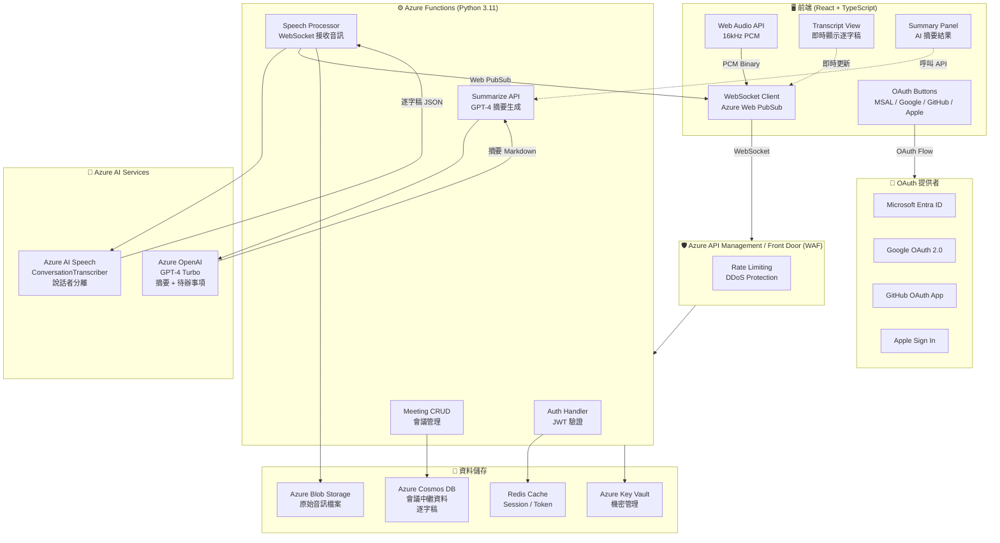
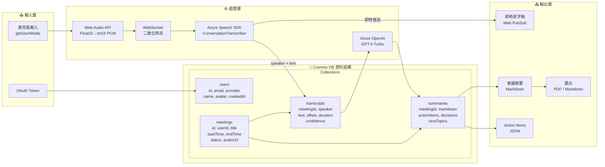
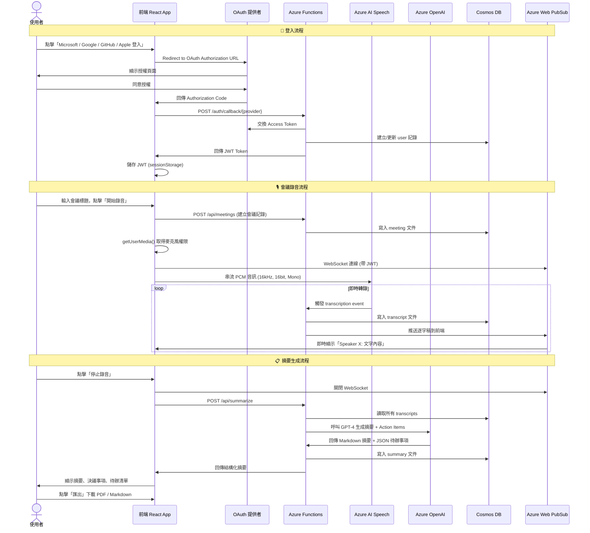

# xCloudLisbot — AI 會議智慧記錄系統

> **即時語音轉錄 · 說話者分離 · AI 智慧摘要 · 多平台 OAuth 登入**

基於 Azure OpenAI + Azure AI Speech 的企業級會議記錄 SaaS，支援 Microsoft / Google / GitHub / Apple 四平台 OAuth 登入，透過 Web Audio API 即時擷取音訊、進行說話者分離，並使用 GPT-4 自動產生結構化會議摘要與待辦事項。

---

## 技術棧

| 層次 | 技術 |
|------|------|
| 前端 | React 18 + TypeScript + Tailwind CSS + MSAL.js |
| 後端 | Azure Functions v4 (Python 3.11) |
| AI 語音 | Azure AI Speech — Conversation Transcription (Diarization) |
| AI 摘要 | Azure OpenAI GPT-4 Turbo |
| 即時通訊 | Azure Web PubSub (WebSocket) |
| 資料庫 | Azure Cosmos DB (NoSQL) |
| 檔案儲存 | Azure Blob Storage |
| 身份驗證 | JWT + MSAL / OAuth 2.0 |
| 基礎建設 | Terraform (IaC) |
| CI/CD | GitHub Actions |

---

## 系統架構圖



---

## 資料庫與資料流架構圖



---

## 使用者操作流程圖



---

## 專案結構

```
xCloudLisbot/
├── README.md
├── .gitignore
├── .env.example
│
├── frontend/                        # React 18 + TypeScript
│   ├── package.json
│   ├── tsconfig.json
│   ├── .env.example
│   ├── public/
│   │   └── index.html
│   └── src/
│       ├── index.tsx                # 入口點
│       ├── App.tsx                  # 主應用程式 + MSAL Provider
│       ├── App.css
│       ├── types/
│       │   └── index.ts             # TypeScript 型別定義
│       ├── hooks/
│       │   └── useAudioRecorder.ts  # Web Audio API Hook
│       ├── contexts/
│       │   └── AuthContext.tsx      # 全域身份驗證 Context
│       └── components/
│           ├── OAuthButtons.tsx     # 四平台登入按鈕
│           ├── RecordingPanel.tsx   # 錄音控制面板
│           ├── TranscriptView.tsx   # 即時逐字稿顯示
│           └── SummaryPanel.tsx     # 摘要結果展示
│
├── backend/                         # Azure Functions v4 (Python)
│   ├── requirements.txt
│   ├── host.json
│   ├── local.settings.json.example
│   └── function_app.py              # 所有 Functions 主檔
│
├── infrastructure/                  # Terraform IaC
│   ├── main.tf                      # 所有 Azure 資源定義
│   ├── variables.tf
│   ├── outputs.tf
│   └── terraform.tfvars.example
│
├── .github/
│   └── workflows/
│       ├── frontend-deploy.yml      # 部署前端至 Azure Static Web Apps
│       └── backend-deploy.yml       # 部署後端至 Azure Functions
│
└── docs/
    └── oauth-setup.md               # OAuth 應用程式設定指南
```

---

## 快速開始

### 前置需求

- Node.js 18+
- Python 3.11+
- Azure CLI (`az login`)
- Terraform >= 1.5
- Azure Functions Core Tools v4

### 1. 部署基礎建設

```bash
cd infrastructure
cp terraform.tfvars.example terraform.tfvars
# 填入你的 Azure Subscription ID 與 OpenAI 設定
terraform init
terraform plan -out=tfplan
terraform apply tfplan
```

### 2. 設定 OAuth 應用程式

請參閱 [docs/oauth-setup.md](docs/oauth-setup.md)，依序完成四個平台的應用程式註冊。

### 3. 啟動後端

```bash
cd backend
cp local.settings.json.example local.settings.json
# 填入 Terraform output 的各項 Key
pip install -r requirements.txt
func start
```

### 4. 啟動前端

```bash
cd frontend
cp .env.example .env
# 填入後端 URL 與 OAuth Client IDs
npm install
npm start
```

---

## 環境變數說明

| 變數名稱 | 說明 |
|---------|------|
| `REACT_APP_AZURE_CLIENT_ID` | Microsoft Entra ID App Client ID |
| `REACT_APP_GOOGLE_CLIENT_ID` | Google OAuth 2.0 Client ID |
| `REACT_APP_GITHUB_CLIENT_ID` | GitHub OAuth App Client ID |
| `REACT_APP_BACKEND_URL` | Azure Functions 後端 URL |
| `AZURE_OPENAI_ENDPOINT` | Azure OpenAI 服務端點 |
| `AZURE_OPENAI_KEY` | Azure OpenAI API Key |
| `SPEECH_KEY` | Azure AI Speech Service Key |
| `SPEECH_REGION` | Azure AI Speech 區域 (e.g. `eastasia`) |
| `COSMOS_ENDPOINT` | Cosmos DB 端點 |
| `COSMOS_KEY` | Cosmos DB Primary Key |
| `JWT_SECRET` | JWT 簽名密鑰 (建議 32 字元以上) |
| `APPLE_TEAM_ID` | Apple Developer Team ID |
| `APPLE_KEY_ID` | Apple Sign In Key ID |
| `APPLE_PRIVATE_KEY` | Apple .p8 私鑰內容 |

---

## 部署架構（Azure 資源清單）

| 資源 | SKU | 用途 |
|------|-----|------|
| Azure Static Web Apps | Standard | 前端托管 |
| Azure Functions (Linux) | EP2 Elastic Premium | 後端 API |
| Azure OpenAI | GPT-4 Turbo | AI 摘要生成 |
| Azure AI Speech | Standard | 語音轉文字 + 說話者分離 |
| Azure Web PubSub | Standard (1 unit) | 即時 WebSocket |
| Azure Cosmos DB | Serverless | 中繼資料儲存 |
| Azure Blob Storage | LRS | 音訊檔案儲存 |
| Azure Key Vault | Standard | 機密管理 |
| Azure API Management | Developer | API 閘道 |

> **預估月費用**：約 USD $150–300（視使用量而定），OpenAI 用量另計。

---

## License

MIT © 2024 xCloudLisbot Contributors
