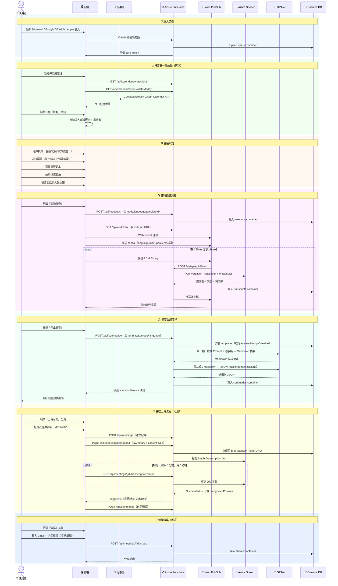

# xCloudLisbot — AI 會議智慧記錄系統 v2.0

> **即時字幕 · 說話者分離 · AI 摘要 · 行事曆整合 · 術語辭典 · 多語言 · 團隊協作**

xCloudLisbot 是基於 Azure 雲端原生技術打造的企業級 AI 會議記錄 SaaS 平台。支援即時語音轉錄、智慧摘要、行事曆一鍵啟動、多語言（含台語/客語）、音檔上傳、術語強化、自訂摘要範本及基本團隊協作功能。

---

## ✨ 功能總覽

| 功能 | 說明 |
|------|------|
| 🎙️ **多模式即時字幕** | 支援會議、訪談、腦力激盪、課堂、Stand-up、評審、客戶會議 7 種模式，含說話者分離 |
| 📅 **行事曆整合** | 整合 Google Calendar 與 Microsoft Exchange/Outlook，一鍵從行事曆啟動會議記錄 |
| 🗣️ **台/客語支援** | 目前少數支援台語（nan-TW）、客語（hak-TW）輸入，自動以繁中輸出 |
| 📁 **音檔上傳轉錄** | 支援 MP3/WAV/MP4/M4A/OGG/FLAC 上傳，Azure Speech 批次轉錄，最大 200MB |
| 📋 **多種摘要範本** | 7 種內建範本 + 無限自訂，支援 GPT System Prompt 覆寫 |
| 📚 **術語辭典** | 建立專業術語對照表，透過 Azure Speech PhraseList 提升辨識準確率 |
| 🌐 **多語言** | 繁中、英文、日文、簡中、台語、客語、自動偵測 |
| 👥 **團隊協作** | 會議分享（檢視/編輯權限）、邀請通知、協作成員管理 |
| 🔐 **多平台登入** | Microsoft / Google / GitHub / Apple 四平台 OAuth 2.0 |
| 📤 **匯出** | Markdown、JSON 格式匯出 |

---

## 🏗️ 技術棧

| 層次 | 技術 |
|------|------|
| 前端 | React 18 + TypeScript + Tailwind CSS + MSAL.js |
| 後端 | Azure Functions v4 (Python 3.11) |
| AI 語音 | Azure AI Speech — ConversationTranscriber（說話者分離）+ Batch Transcription |
| AI 摘要 | Azure OpenAI GPT-4 Turbo（雙輪：Markdown 摘要 + JSON 結構化） |
| 即時通訊 | Azure Web PubSub（WebSocket） |
| 資料庫 | Azure Cosmos DB Serverless（8 個 Container） |
| 檔案儲存 | Azure Blob Storage |
| 身份驗證 | JWT + MSAL.js / OAuth 2.0 PKCE |
| 基礎建設 | Terraform (IaC) |
| CI/CD | GitHub Actions |

---

## 🗺️ 系統架構圖

```mermaid
graph TB
    subgraph Client["🖥️ 前端 (React 18 + TypeScript + Tailwind CSS)"]
        A1[Web Audio API<br/>16kHz PCM 錄音]
        A2[音檔上傳<br/>MP3/WAV/MP4…]
        A3[行事曆面板<br/>Google / Outlook]
        A4[MeetingConfigCard<br/>模式・語言・範本・術語]
        A5[即時逐字稿<br/>說話者標色]
        A6[摘要面板<br/>Markdown + Action Items]
        A7[術語辭典 Modal]
        A8[摘要範本 Modal]
        A9[分享協作 Modal]
        A10[MSAL.js OAuth]
    end

    subgraph PubSub["📡 Azure Web PubSub"]
        PS[WebSocket Hub<br/>speech_hub]
    end

    subgraph Functions["⚙️ Azure Functions v4 (Python 3.11)"]
        F1[GET /api/ws/token<br/>取得 PubSub 連線 URL]
        F2[POST /ws/speech<br/>PubSub Event Handler]
        F3[POST /api/summarize<br/>雙輪 GPT-4 摘要]
        F4[/api/meetings CRUD]
        F5[/api/terminology CRUD]
        F6[/api/templates CRUD]
        F7[/api/meetings/upload<br/>音檔 + 批次轉錄]
        F8[/api/meetings/share CRUD]
        F9[/api/calendar/* OAuth + Events]
        F10[/api/auth/* 四平台 OAuth]
    end

    subgraph AzureAI["🤖 Azure AI Services"]
        S1[Azure AI Speech<br/>ConversationTranscriber<br/>PhraseList 術語注入]
        S2[Azure Speech<br/>Batch Transcription API<br/>音檔非同步轉錄]
        S3[Azure OpenAI GPT-4<br/>模式 + 範本 Prompt<br/>雙輪生成]
    end

    subgraph DB["💾 Azure Cosmos DB (Serverless)"]
        D1[(users)]
        D2[(meetings)]
        D3[(transcripts)]
        D4[(summaries)]
        D5[(terminology)]
        D6[(templates)]
        D7[(shares)]
        D8[(calendar_tokens)]
    end

    subgraph Blob["📦 Azure Blob Storage"]
        B1[audio-recordings<br/>原始音檔 + SAS URL]
    end

    subgraph OAuth["🔐 OAuth / Calendar 提供者"]
        O1[Microsoft Entra ID<br/>+ Graph API Calendar]
        O2[Google OAuth 2.0<br/>+ Calendar API]
        O3[GitHub OAuth]
        O4[Apple Sign In]
    end

    A1 -->|PCM Binary| PS
    A2 -->|Upload Binary| F7
    A3 -->|OAuth + Events| F9
    A4 --> A1
    A10 --> O1 & O2 & O3 & O4
    PS <-->|WebSocket| F2
    F1 -->|Client URL| PS
    F2 --> S1
    S1 -->|逐字稿| F2
    F2 -->|Web PubSub Push| PS
    PS -->|即時推送| A5
    F3 --> S3
    F7 --> B1
    F7 --> S2
    S2 -->|批次結果| F7
    F9 --> O1 & O2
    F4 & F5 & F6 & F7 & F8 & F9 --> D1 & D2 & D3 & D4 & D5 & D6 & D7 & D8
```

---

## 🗄️ 資料庫資料流架構圖

```mermaid
flowchart TD
    subgraph Input["📥 輸入層"]
        I1[🎙️ 即時麥克風錄音]
        I2[📁 音檔上傳]
        I3[📅 行事曆事件]
        I4[🔐 OAuth 登入]
        I5[📚 術語辭典設定]
        I6[📋 摘要範本設定]
    end

    subgraph Process["⚙️ 處理層"]
        P1[Web Audio API<br/>Float32→Int16 PCM 16kHz]
        P2[Azure Web PubSub<br/>WebSocket 二進位串流]
        P3[ConversationTranscriber<br/>+ PhraseList 術語注入]
        P4[Batch Transcription API<br/>非同步轉錄]
        P5[GPT-4 第一輪<br/>模式 + 範本 Prompt → Markdown]
        P6[GPT-4 第二輪<br/>Markdown → 結構化 JSON]
    end

    subgraph CosmosDB["💾 Cosmos DB — 8 個 Container"]
        C1["👤 users<br/>id · email · provider<br/>name · avatar · createdAt<br/><i>PK: /id</i>"]
        C2["📋 meetings<br/>id · userId · title · mode<br/>language · templateId<br/>status · audioUrl · transcriptionJobId<br/><i>PK: /id</i>"]
        C3["📝 transcripts<br/>id · meetingId · speaker<br/>text · offset · duration<br/>confidence · language<br/><i>PK: /meetingId</i>"]
        C4["📊 summaries<br/>meetingId · summary(MD)<br/>actionItems · keyDecisions<br/>nextMeetingTopics<br/>templateId · language<br/><i>PK: /meetingId</i>"]
        C5["📚 terminology<br/>id · userId · name<br/>terms[] · isActive<br/><i>PK: /id</i>"]
        C6["📋 templates<br/>id · userId · name · icon<br/>systemPromptOverride<br/><i>PK: /userId</i>"]
        C7["👥 shares<br/>id · meetingId · ownerId<br/>memberEmail · permission<br/><i>PK: /id</i>"]
        C8["🗓️ calendar_tokens<br/>id · userId · provider<br/>tokenData · updatedAt<br/><i>PK: /id</i>"]
    end

    subgraph BlobStorage["📦 Blob Storage"]
        BL[audio-recordings/<br/>{userId}/{meetingId}.{ext}]
    end

    subgraph Output["📤 輸出層"]
        O1[⚡ 即時逐字稿<br/>Web PubSub Push]
        O2[📄 Markdown 摘要]
        O3[✅ Action Items JSON]
        O4[🔑 決議事項清單]
        O5[📅 下次議題建議]
        O6[📤 匯出 MD / JSON]
    end

    I4 --> C1
    I1 --> P1 --> P2 --> P3 --> C3
    I2 --> BL --> P4 --> C3
    I3 --> C8
    I5 --> C5
    I6 --> C6
    P3 -->|PhraseList| C5
    C2 --> C3 & C4
    C3 --> P5
    C5 -->|術語| P3
    C6 -->|systemPromptOverride| P5
    P5 --> P6
    P5 --> C4
    P6 --> C4
    P3 --> O1
    C4 --> O2 & O3 & O4 & O5
    O2 --> O6
```

---

## 👤 使用者操作流程圖



---

## 📁 專案結構

```
xCloudLisbot/
├── README.md                            # 本文件
├── .gitignore
├── .env.example                         # 所有環境變數範本
│
├── frontend/                            # React 18 + TypeScript + Tailwind
│   ├── package.json
│   ├── tsconfig.json
│   ├── vite.config.ts                   # Vite 5 建置設定（含 REACT_APP_* 對應）
│   ├── index.html                       # Vite 入口 HTML
│   ├── Dockerfile                       # 多階段建置（Node 20 + nginx）
│   ├── nginx.conf                       # nginx 反向代理設定
│   └── src/
│       ├── index.tsx
│       ├── App.tsx                      # 主應用 + 狀態管理
│       ├── types/
│       │   └── index.ts                 # 完整 TypeScript 型別定義
│       ├── hooks/
│       │   └── useAudioRecorder.ts      # Web Audio API Hook
│       ├── contexts/
│       │   └── AuthContext.tsx          # JWT + MSAL 全域認證 Context
│       └── components/
│           ├── OAuthButtons.tsx         # 四平台登入按鈕
│           ├── MeetingConfigCard.tsx    # 會議設定（模式/語言/範本/術語）
│           ├── RecordingPanel.tsx       # 即時錄音 + Web PubSub WebSocket
│           ├── AudioUploadPanel.tsx     # 音檔上傳 + 批次轉錄輪詢
│           ├── CalendarPanel.tsx        # Google/Outlook 行事曆側邊欄
│           ├── TranscriptView.tsx       # 即時逐字稿顯示
│           ├── SummaryPanel.tsx         # 摘要結果 + 匯出
│           ├── TermDictionaryModal.tsx  # 術語辭典 CRUD Modal
│           ├── SummaryTemplateModal.tsx # 摘要範本 CRUD Modal
│           └── ShareMeetingModal.tsx   # 會議協作分享 Modal
│
├── backend/                             # Azure Functions v4 (Python 3.11)
│   ├── requirements.txt
│   ├── host.json
│   ├── local.settings.json.example
│   └── function_app.py                  # 33 個 HTTP 端點全部集中此檔
│
├── infrastructure/                      # Terraform IaC
│   ├── main.tf                          # 所有 Azure 資源（含 8 個 Cosmos 容器）
│   ├── variables.tf
│   ├── outputs.tf
│   └── terraform.tfvars.example
│
├── .github/
│   └── workflows/
│       ├── frontend-deploy.yml          # 部署至 Azure Static Web Apps
│       └── backend-deploy.yml           # 部署至 Azure Functions
│
└── docs/
    ├── oauth-setup.md                   # OAuth 應用程式設定指南
    ├── 操作手冊.md                      # 使用者完整操作手冊
    └── azure-部署手冊.md               # Azure 完整部署步驟
```

---

## 🔌 API 端點清單（33 個）

### 認證
| Method | Path | 說明 |
|--------|------|------|
| POST | `/api/auth/callback/microsoft` | Microsoft OAuth 回調 |
| GET | `/api/auth/login/google` | Google OAuth 啟動 |
| GET | `/api/auth/callback/google` | Google OAuth 回調 |
| GET | `/api/auth/login/github` | GitHub OAuth 啟動 |
| GET | `/api/auth/callback/github` | GitHub OAuth 回調 |
| GET | `/api/auth/login/apple` | Apple Sign In 啟動 |
| POST | `/api/auth/callback/apple` | Apple Sign In 回調 |

### WebSocket
| Method | Path | 說明 |
|--------|------|------|
| GET | `/api/ws/token` | 取得 Web PubSub Client Access URL |
| POST | `/ws/speech` | Web PubSub Event Handler（音訊處理） |

### 會議管理
| Method | Path | 說明 |
|--------|------|------|
| POST | `/api/meetings` | 建立會議記錄（含 mode/language/templateId） |
| GET | `/api/meetings` | 列出我的會議（最新 20 筆） |
| GET | `/api/meetings/{id}` | 取得單一會議 |
| POST | `/api/meetings/{id}/upload` | 上傳音檔並觸發批次轉錄 |
| GET | `/api/meetings/{id}/transcription-status` | 查詢批次轉錄進度與結果 |
| POST | `/api/summarize` | AI 摘要生成（含範本/模式/語言） |

### 術語辭典
| Method | Path | 說明 |
|--------|------|------|
| GET | `/api/terminology` | 列出我的術語辭典 |
| POST | `/api/terminology` | 新增辭典 |
| PUT | `/api/terminology/{id}` | 更新辭典 |
| DELETE | `/api/terminology/{id}` | 刪除辭典 |

### 摘要範本
| Method | Path | 說明 |
|--------|------|------|
| GET | `/api/templates` | 列出我的自訂範本 |
| POST | `/api/templates` | 新增自訂範本 |
| PUT | `/api/templates/{id}` | 更新範本 |
| DELETE | `/api/templates/{id}` | 刪除範本 |

### 團隊協作
| Method | Path | 說明 |
|--------|------|------|
| GET | `/api/meetings/{id}/share` | 取得分享成員清單 |
| POST | `/api/meetings/{id}/share` | 邀請成員（email + 權限） |
| DELETE | `/api/meetings/{id}/share/{email}` | 撤銷分享 |

### 行事曆整合
| Method | Path | 說明 |
|--------|------|------|
| GET | `/api/calendar/connections` | 查詢 Google/Microsoft 連線狀態 |
| GET | `/api/auth/calendar/google` | Google Calendar OAuth 啟動 |
| GET | `/api/auth/callback/calendar/google` | Google Calendar OAuth 回調 |
| POST | `/api/auth/calendar/microsoft` | 儲存 Microsoft Graph Calendar Token |
| GET | `/api/calendar/events` | 取得指定日期的行事曆事件 |

---

## ⚙️ 環境變數說明

### 前端（`frontend/.env`）
| 變數 | 說明 |
|------|------|
| `REACT_APP_AZURE_CLIENT_ID` | Microsoft Entra ID App Client ID |
| `REACT_APP_AZURE_TENANT_ID` | Tenant ID（預設 `common`） |
| `REACT_APP_GOOGLE_CLIENT_ID` | Google OAuth 2.0 Client ID |
| `REACT_APP_GITHUB_CLIENT_ID` | GitHub OAuth App Client ID |
| `REACT_APP_BACKEND_URL` | Azure Functions 後端 URL |

### 後端（`backend/local.settings.json`）
| 變數 | 說明 |
|------|------|
| `AZURE_OPENAI_ENDPOINT` | Azure OpenAI 服務端點 |
| `AZURE_OPENAI_KEY` | Azure OpenAI API Key |
| `AZURE_OPENAI_DEPLOYMENT` | 部署名稱（如 `gpt-4`） |
| `SPEECH_KEY` | Azure AI Speech Service Key |
| `SPEECH_REGION` | Speech 區域（如 `eastasia`） |
| `COSMOS_ENDPOINT` | Cosmos DB 帳戶端點 |
| `COSMOS_KEY` | Cosmos DB Primary Key |
| `COSMOS_DATABASE` | 資料庫名稱（預設 `lisbot`） |
| `AZURE_STORAGE_CONNECTION_STRING` | Blob Storage 連線字串 |
| `STORAGE_CONTAINER` | 音檔容器名稱（預設 `audio-recordings`） |
| `WEB_PUBSUB_ENDPOINT` | Web PubSub 端點 |
| `WEB_PUBSUB_KEY` | Web PubSub Access Key |
| `WEB_PUBSUB_HUB` | Hub 名稱（預設 `speech_hub`） |
| `JWT_SECRET` | JWT 簽名密鑰（≥32 字元） |
| `GOOGLE_CLIENT_ID` / `GOOGLE_CLIENT_SECRET` | Google OAuth 憑證 |
| `GITHUB_CLIENT_ID` / `GITHUB_CLIENT_SECRET` | GitHub OAuth 憑證 |
| `APPLE_TEAM_ID` / `APPLE_KEY_ID` / `APPLE_CLIENT_ID` / `APPLE_PRIVATE_KEY` | Apple Sign In |
| `FRONTEND_URL` | 前端網址（CORS + postMessage 用） |
| `ALLOWED_ORIGINS` | CORS 允許來源（逗號分隔） |

---

## 📦 Azure 資源清單

| 資源 | SKU | 用途 |
|------|-----|------|
| Azure Static Web Apps | Standard | 前端托管 + CDN |
| Azure Functions (Linux) | EP2 Elastic Premium | 後端 API 33 端點 |
| Azure OpenAI | GPT-4 Turbo | AI 摘要（雙輪生成） |
| Azure AI Speech | Standard S0 | 即時轉錄 + 批次轉錄 + 說話者分離 |
| Azure Web PubSub | Standard S1 (1 unit) | 即時 WebSocket 推送 |
| Azure Cosmos DB | Serverless | 8 個 Container 資料儲存 |
| Azure Blob Storage | LRS Standard | 音檔儲存 + SAS URL |
| Azure Key Vault | Standard | 機密管理 |
| Azure API Management | Developer | API 閘道 + CORS |

> **💰 預估月費用**：USD $180–350（視使用量），OpenAI 用量另計（約 $0.01–0.03/千 token）

---

## 🚀 快速開始

### 前置需求
- Node.js 20+、Python 3.11+、Azure CLI、Terraform ≥ 1.5、Azure Functions Core Tools v4

### 1. 部署 Azure 基礎建設
```bash
cd infrastructure
cp terraform.tfvars.example terraform.tfvars
# 填入 subscription_id 與 openai_location 等參數
terraform init && terraform apply
```

### 2. 設定後端
```bash
cd backend
cp local.settings.json.example local.settings.json
# 填入 Terraform output 的各項 Key
pip install -r requirements.txt
func start
```

### 3. 設定前端
```bash
cd frontend
cp .env.example .env
# 填入後端 URL 與 OAuth Client IDs
npm install && npm start
```

> 完整部署步驟請參閱 [docs/azure-部署手冊.md](docs/azure-部署手冊.md)

---

## 📖 文件

| 文件 | 說明 |
|------|------|
| [docs/操作手冊.md](docs/操作手冊.md) | 使用者完整操作說明 |
| [docs/azure-部署手冊.md](docs/azure-部署手冊.md) | Azure 雲端完整部署流程 |
| [docs/oauth-setup.md](docs/oauth-setup.md) | OAuth 應用程式設定指南 |

---

## License

MIT © 2025 xCloudLisbot Contributors
